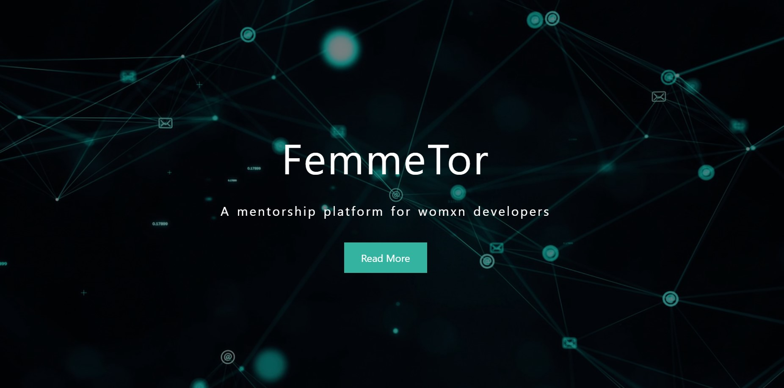
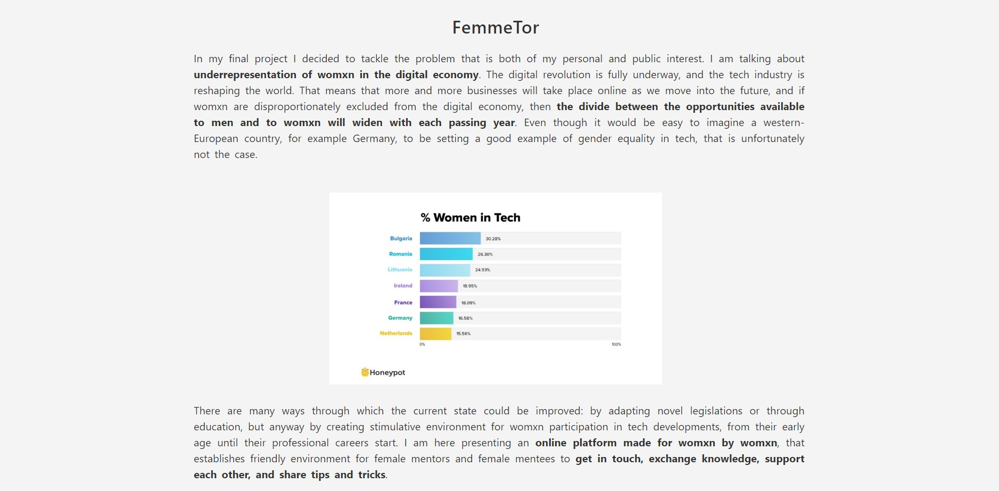
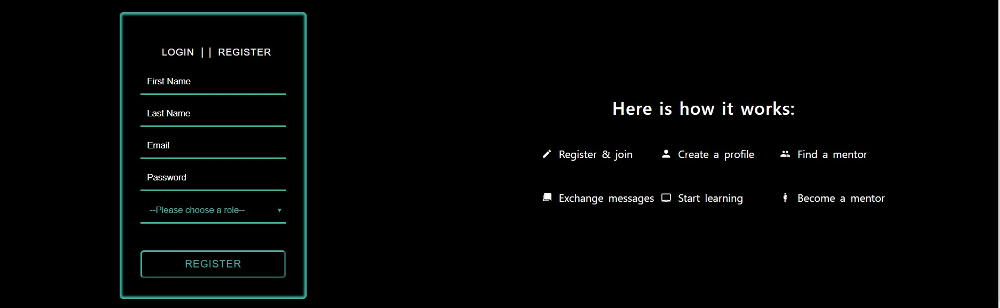
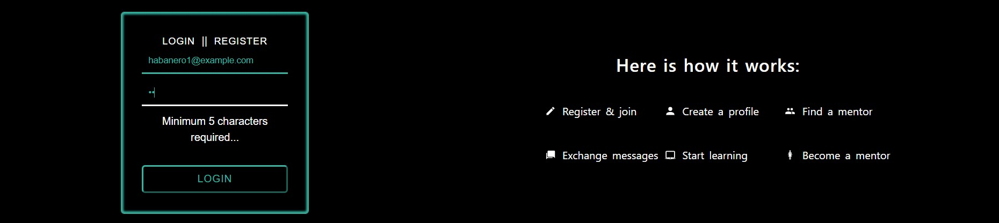
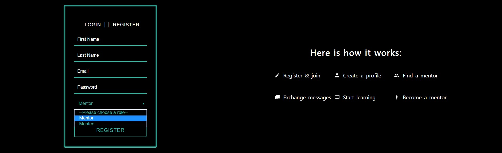
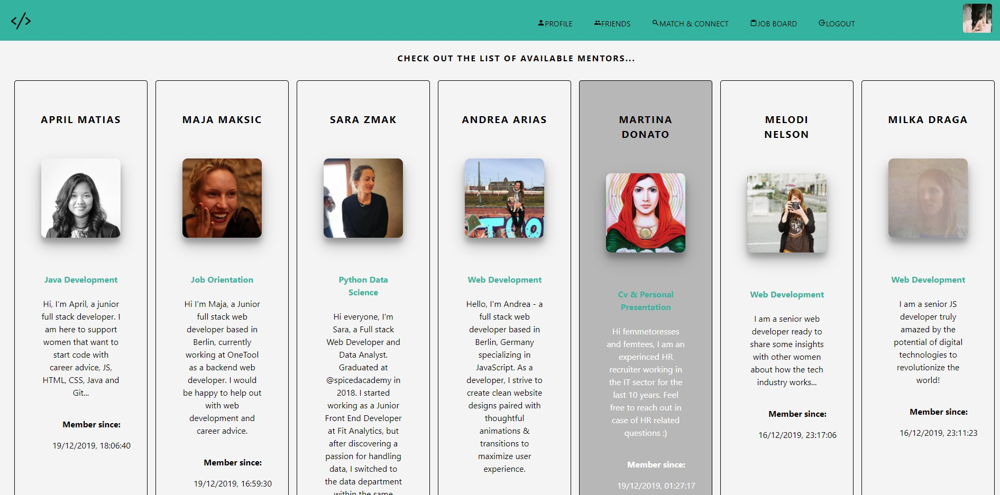

# FemmeTor || A mentorship platform for womxn developers

## Overview

A single-page platform for womxn developers built with React, where users can choose their role (mentor/mentee), find a mentor or a mentee, request a mentorship, chat and share job offers with each other.

Technologies used: React.js, Redux, socket.io, PostgreSQL, Node.js ... and of course JavaScript and CSS.

This project was build within 12 days of learning React.js and Redux by doing and coding. The result represents core features of a social network.

For me this was a good opportunity to gather more practical experience with asychronous JavaScript (using Promises and async/await) as well as with database queries - and to explore React, a very powerful framework for buildung single-site applications.

## App Features in details

### Landing Page

When the app loads a landing page appears.

By clicking on the "Read More" button the user is being redirected to the About Section with details about the background of the project.

### Registration, login and own profile

Starting off people can create an account or sign in.

An error message is displayed when a user omits to fill in a required field or enters credentials that are not valid.
For login and registration I used a Higher Order Component (HOC) that contains the logic for both processes and forms and bcyrpt for password encryption.

During registration the user has to choose a role (mentor / mentee):

Once registered/logged in a user can edit her profile - upload a personal profile picture, add some information about herself or update both.
The profile pictures are stored online at Amazon Webservice cloud storage.

### Finding people on the network

The match and connect feature allows you to automatically get a list of users whose role is different than the logged in user's role.
E.g.: In case you're logged in as a mentor you'll get a filtered list of mentees and vice versa and view their profiles.
On each user profile, besides the profile info and the bio we can see the user's role.

### Mentorship button

Only the mentees are enabled to request a mentorship. Once the mentee has requested a mentorship the
button text changes and the user can cancel the mentorship request. Once the mentor has accepted the
mentorship request a relationship has been established and there's always an option to end the mentorship
by either the mentee or the mentor.
If logged in as a mentor you're not able to see the mentorship button on other users profiles.
Nevertheless all users are enabled to use the chat feature to contact other platform users.

//picture
